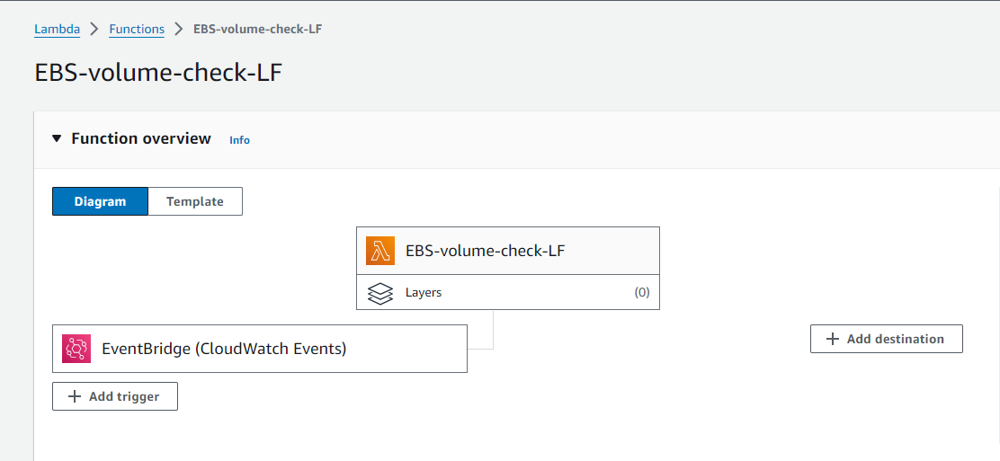
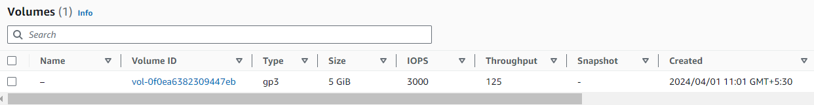
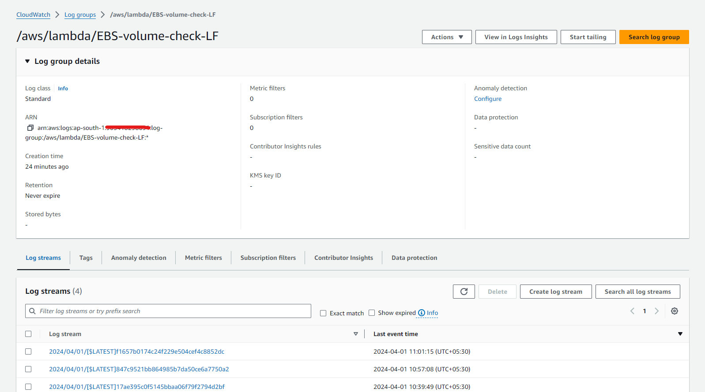

# Automation for modifying AWS GP2 storage to GP3 storage

gp3 generally cost up to 20% less per GB than gp2 volumes,

As a Cloud Engineering team we take care of the AWS environment and make sure it is in compliance with the organizational policies.We use AWS cloud watch in combination with AWS Lambda to govern the resources according to the policies.For example, we Trigger a Lambda function when an Amazon Elastic Block Store (EBS) volume is created. We use Amazon CloudWatch Events. CloudWatch Events that allows us to monitor and respond to EBS volumes that are of type GP2 and convert them to type GP3.


```bash

```





